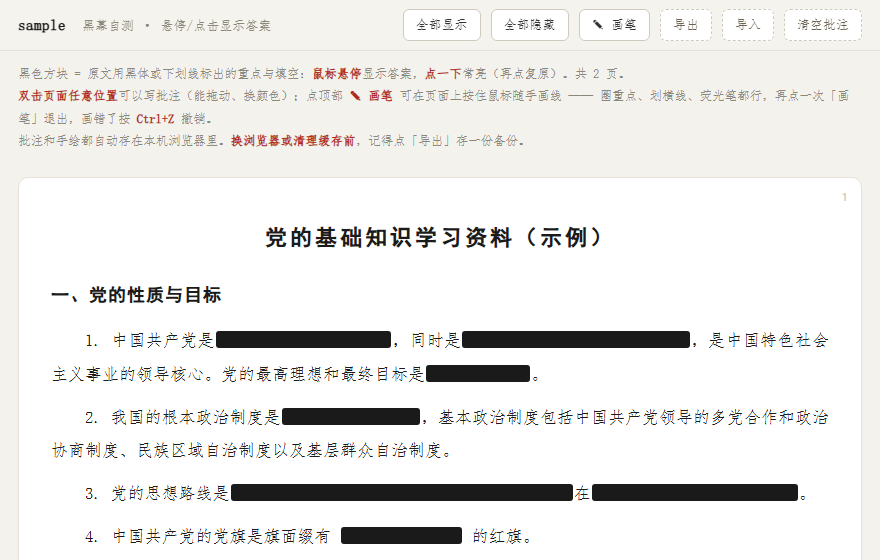
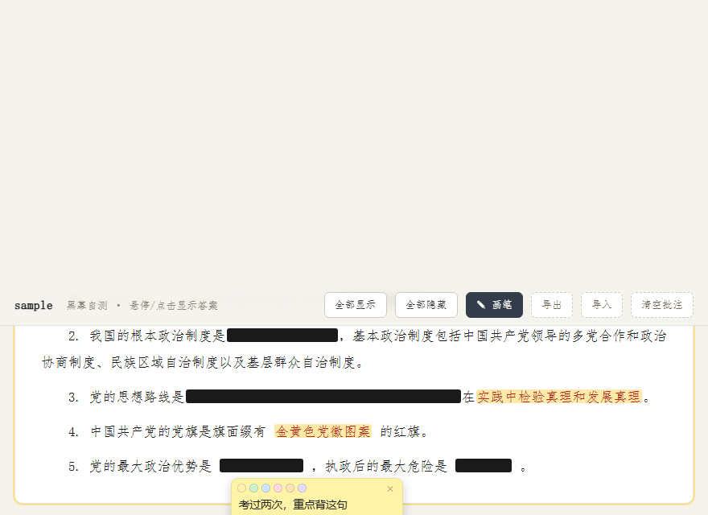
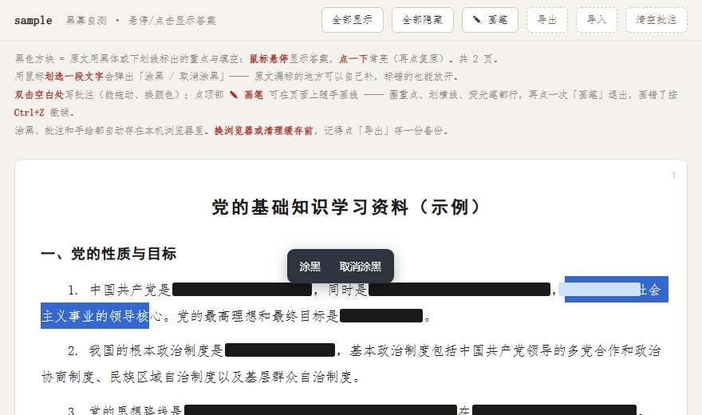

# pdf-mask-study

把 PDF 复习资料变成「**黑幕自测**」网页 —— 自动找出原文自己标出的**黑体重点**和**下划线填空**，把它们遮成黑幕，鼠标悬停才显示答案。

适合考公、考研、党课、资格证这类「一段话里挖空让你背」的资料。生成的网页不依赖网络，**双击就能用，也能直接发给同学**。



## 它是什么

同一份 PDF，原来的样子可能是这样：

> 中国共产党是**中国工人阶级的先锋队**，同时是**中国人民和中华民族的先锋队**。
>
> 党的最高理想和最终目标是<u>实现共产主义</u>。

工具会把它变成：

> 中国共产党是 █████████████，同时是 ███████████████。
>
> 党的最高理想和最终目标是 █████████。

鼠标划过去答案才出现，逼着你先回忆一遍，比直接看书有效得多。

## 特色

| | |
|---|---|
| **自动识别，不用手工挖空** | 直接读 PDF 底层的字体和线条信息，找出黑体字和带下划线的文字 |
| **划选就能补** | 原文漏标的地方，鼠标划选一段文字即可涂黑；标错了也能一键放开 |
| **悬停显示，点一下常亮** | 想自测就悬停，想通读就点开；工具栏还有「全部显示 / 全部隐藏」 |
| **可以写批注** | 页面空白处双击就能写便签，能拖动、能换 6 种颜色，自动保存 |
| **可以随手画** | 点「✎ 画笔」用鼠标在页面上圈划、画荧光笔，`Ctrl+Z` 撤销 |
| **答案不丢字** | 黑幕只是遮住，原文一个字都没删（有单元测试守着） |
| **手机也能看** | 生成的网页自适应窄屏 |
| **打印友好** | 打印时黑幕自动变成「下划线 + 黑字」，可以直接印成纸质资料 |
| **零依赖** | 生成的 HTML 不联网、不带外部文件，一个文件就是全部 |



## 快速开始

### 方式一：用打包好的 exe（Windows，推荐）

到 [Releases](../../releases) 下载 `pdf-mask-study.exe`，双击打开：

1. 选一个 PDF 文件
2. 点「开始生成」
3. 自动用浏览器打开生成好的网页

不用装 Python，不用联网。

### 方式二：从源码运行

```bash
pip install -r requirements.txt

# 图形界面
python -m pdfmask.gui

# 或者命令行
python -m pdfmask 复习资料.pdf
python -m pdfmask 复习资料.pdf -o 输出.html -t "期末冲刺"
```

想先看看效果，可以用仓库自带的示例：

```bash
python tools/make_sample.py          # 生成 examples/sample.pdf
python -m pdfmask examples/sample.pdf --no-open
```

## 它怎么判断哪些该遮

PDF 里没有「这里是重点」这种标记，但排版会留下痕迹。工具读两样东西：

**1. 黑体 / 粗体字** —— 正文多用宋体、仿宋，重点句会换成黑体（或者带粗体标志）。工具先统计全文用得最多的字体当「正文基准」，再把明显不同的加粗字体认作重点，同时排除标题（字号明显更大的那种）。

**2. 下划线** —— 页面上贴在文字底部的细横线。线上有字的就是「划了线的答案」，线上没字的就是「留白的填空横线」，两种都会处理。超链接的下划线（蓝色文字）会被自动排除。

拿不准的时候，它宁可少遮也不乱遮：

- 标题一律不遮
- 比正文大 25% 以上的字不遮（那是标题）
- 遮不遮完全不影响原文，只是视觉上盖住

> 如果你的资料**既不用黑体也不用下划线**标重点（比如纯靠颜色、加框、或者压根没标），这个工具帮不上忙 —— 它不会自己去猜哪里是重点。

## 生成的网页怎么用

| 操作 | 效果 |
|---|---|
| 鼠标悬停黑色方块 | 显示答案 |
| 单击 | 让答案常亮，再点一下盖回去 |
| 顶部「全部显示 / 全部隐藏」 | 一键切换 |
| **鼠标划选一段文字** | 弹出「涂黑 / 取消涂黑」—— 补上原文漏标的重点，或把标错的地方放开 |
| **双击空白处** | 写一条批注（拖动顶部细条移动，点小圆点换色，× 删除） |
| 点顶部「✎ 画笔」 | 进入画笔模式，按住鼠标画线；面板里有 6 种颜色、3 档粗细、橡皮 |
| **`Ctrl+Z`** | 撤销上一步（画错的一笔、擦掉的一笔、清空的整页都能撤回） |
| 「导出 / 导入」 | 把涂黑、批注和手绘打包成 JSON 备份，换电脑时恢复 |



涂黑、批注、手绘、画笔设置都存在浏览器本地（localStorage），按文档分开存，互不干扰。**清理浏览器缓存或换浏览器前，记得点「导出」存个备份。**

## 命令行参数

```
python -m pdfmask <文件.pdf> [选项]

  -o, --output   输出 HTML 路径（默认：<文件名>_背诵版.html）
  -t, --title    网页标题（默认用文件名）
  --no-open      生成后不自动打开浏览器
  --footer       页脚说明文字
```

## 常见问题

**生成的网页里一个黑幕都没有？**

说明这份 PDF 没用黑体或下划线标重点。可以用 Adobe Acrobat、Word 等先给重点换成黑体 / 加下划线，再转一次；或者直接在生成的网页上用画笔自己划。

**生成的 HTML 能发给别人吗？**

可以，单个文件发给谁都行，对方双击就能看。但**你写的批注和手绘存在你自己的浏览器里**，不会跟着文件走 —— 想让别人看到你的笔记，得先「导出」再把 JSON 一起发给他。

**黑幕会不会把原文弄丢？**

不会。遮住是纯视觉的，HTML 里原文完好，选中复制、打印、搜索都能拿到。仓库里有测试专门守着这一点。

**能处理扫描版 PDF 吗？**

不能。扫描件是图片，没有文字和字体信息可读，需要先做 OCR 转成文字版 PDF。

## 开发

```bash
pip install -r requirements.txt

# 跑测试（12 项，会现场生成示例 PDF）
python -m unittest discover -s tests -v

# 打包 exe（需要 pyinstaller）
pip install pyinstaller
python build_exe.py
```

代码结构：

```
pdfmask/
├── analyze.py        PDF 结构分析：找出黑体重点和下划线，重建段落
├── render.py         生成 HTML（模板填充、文档 id、文本无损处理）
├── assets/template.html   生成网页的模板：样式 + 黑幕/批注/画笔/撤销全部交互
├── cli.py            命令行入口
└── gui.py            图形界面（tkinter，标准库自带）
tools/make_sample.py  生成演示 / 测试用的示例 PDF
tests/test_analyze.py 单元测试
```

## 已知限制

- 只认**黑体/粗体**和**下划线**两种标记方式，别的标重点习惯（颜色、加框、加粗但字体名看不出）认不出来
- 扫描版 PDF 不支持
- 竖排、多栏排版的 PDF 段落切分可能不准
- 批注和手绘存在浏览器本地，不做云端同步

## 许可

[MIT](LICENSE)
